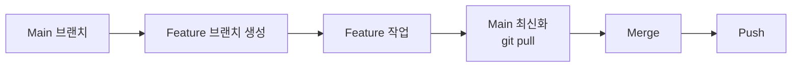

# Git 워크플로우 완전 정리

이 문서는 지금까지 실습한 모든 Git 워크플로우를 정리하고, 각각의 차이점과 사용 시기를 설명합니다.

---

## 1. 실습한 워크플로우 요약

지금까지 다음 4가지 주요 Git 워크플로우를 실습했습니다:

1.  **Fast-forward Merge** (Section 2)
2.  **3-Way Merge** (Section 3)
3.  **Collaboration Workflow** (Section 4-5)
4.  **Rebase** (Section 6)

---

## 2. 각 워크플로우 상세 설명

### 2-1. Fast-forward Merge (빨리 감기 병합)

**상황**:
```
main:     A --- B
               \
feature:        C --- D
```

**진행 과정**:
1.  `main`에서 `feature` 브랜치 생성
2.  `feature`에서 작업 및 커밋 (C, D)
3.  **이 동안 `main`은 변경 없음**
4.  `git merge feature` 실행

**결과**:
```
main:     A --- B --- C --- D (main, feature)
```

**특징**:
*   새로운 병합 커밋이 **생성되지 않음**
*   단순히 `main` 브랜치 포인터만 이동
*   히스토리가 깔끔한 일직선
*   `git log`에서 "Fast-forward" 메시지 출력

**실습 명령어**:
```bash
git checkout -b feature-python-A
echo 'print("Added feature A")' >> abc.py
git commit -am "Update abc.py"
git checkout main
git merge feature-python-A  # Fast-forward!
```

---

### 2-2. 3-Way Merge (3방향 병합)

**상황**:
```
main:     A --- B --- C
               \
feature:        D --- E
```

**진행 과정**:
1.  `main`에서 `feature` 브랜치 생성
2.  `feature`에서 작업 및 커밋 (D, E)
3.  **`main`에서도 새로운 커밋 발생 (C)**
4.  `git merge feature` 실행

**결과**:
```
main:     A --- B --- C -------- M (merge commit)
               \                /
feature:        D ----------- E
```

**특징**:
*   새로운 **병합 커밋 (M)** 생성
*   Y자 모양의 히스토리 유지
*   충돌 가능성 있음 (같은 파일의 같은 부분 수정 시)
*   두 브랜치의 변경사항을 모두 보존

**실습 명령어**:
```bash
# Feature 브랜치에서 작업
git checkout -b feature-python-B
echo 'print("Feature B")' >> sub/def.py
git commit -am "Update def.py in feature-B"

# Main 브랜치에서도 작업
git checkout main
echo 'print("Main update")' >> sub/def.py
git commit -am "Update def.py in main"

# 병합 (3-Way Merge 발생!)
git merge feature-python-B
```

**충돌 해결**:
충돌 발생 시:
1.  파일을 열어 `<<<<<<<`, `=======`, `>>>>>>>` 부분 수정
2.  `git add <파일>`
3.  `git commit`

---

### 2-3. Collaboration Workflow (협업 워크플로우)

**실전 협업 시나리오**:



**핵심 단계**:
1.  **브랜치 생성**: `git checkout -b feature-branch`
2.  **작업 및 커밋**: 여러 번 커밋 가능
3.  **Main 최신화**: `git checkout main && git pull origin main`
4.  **병합**: `git merge feature-branch`
5.  **Push**: `git push origin main`

**포인트**:
*   항상 병합 전에 `main`을 최신 상태로 유지
*   다른 팀원의 변경사항을 먼저 가져옴
*   충돌을 최소화

**Date & Day 시나리오 (Section 5)**:
*   `main`: 날짜 입력 기능 구현
*   `featureB`: `main`에서 `date.py` 가져오기 (`git merge main`)
*   `featureB`: 요일 기능 추가
*   `main`: 병합 (`git merge featureB`) → Fast-forward!

---

### 2-4. Rebase (히스토리 재작성)

**상황**:
```
main:     A --- B --- C
               \
feature:        D --- E
```

**Rebase 명령어**:
```bash
git checkout feature
git rebase main
```

**결과**:
```
main:     A --- B --- C
                       \
feature:                D' --- E'
```

**특징**:
*   `feature`의 커밋들을 `main`의 최신 커밋 위로 **재배치**
*   커밋 해시가 변경됨 (D → D', E → E')
*   일직선 히스토리 생성
*   병합 커밋 없음

**Merge 후 최종 상태** (Fast-forward):
```
main:     A --- B --- C --- D' --- E' (main, feature)
```

**실습 명령어**:
```bash
# 과거 커밋에서 브랜치 생성
git checkout 5d556ed
git checkout -b feature-rebase
echo 'print("Rebase test")' > rebase_test.py
git commit -am "Add rebase_test"

# Rebase 실행
git rebase main

# Fast-forward 병합
git checkout main
git merge feature-rebase
```

---

## 3. 비교표

| 구분 | Fast-forward | 3-Way Merge | Rebase |
|------|--------------|-------------|--------|
| **병합 커밋** | ❌ 없음 | ✅ 있음 | ❌ 없음 |
| **히스토리** | 일직선 | Y자 모양 | 일직선 |
| **커밋 해시 변경** | ❌ 안 함 | ❌ 안 함 | ✅ 함 |
| **사용 시점** | `main` 변경 없을 때 | 양쪽 모두 변경됨 | 로컬 브랜치 정리 |
| **충돌 가능성** | 낮음 | 있음 | 있음 |
| **협업 적합성** | ✅ 안전 | ✅ 안전 | ⚠️ 주의 필요 |

---

## 4. 언제 무엇을 사용할까?

### Fast-forward가 일어나는 경우
*   내가 브랜치를 만든 후 `main`에 변경이 없을 때
*   자동으로 발생 (신경 쓸 필요 없음)

### 3-Way Merge를 사용할 때
*   **여러 사람이 협업**하는 프로젝트
*   각 브랜치의 히스토리를 명확히 남기고 싶을 때
*   안전하고 추천되는 방식

### Rebase를 사용할 때
*   **로컬에서만 작업한 브랜치**를 정리할 때
*   히스토리를 깔끔하게 일직선으로 만들고 싶을 때
*   **절대 Push된 커밋에는 사용 금지!**

---

## 5. 전체 흐름 정리

### 지금까지 당신이 한 것

1.  **Section 1**: Git 저장소 초기화, 파일 추가, Push
2.  **Section 2**: `feature-python-A` 브랜치 생성 → 작업 → Fast-forward Merge
3.  **Section 3**: `feature-python-B` 브랜치 생성 → `main`도 수정 → 3-Way Merge (충돌 해결)
4.  **Section 4-5**: `main`에서 `date.py` 생성 → `featureB`에서 요일 추가 → Fast-forward Merge
5.  **Section 6**: 특정 커밋에서 새 브랜치 생성 → Rebase → Fast-forward Merge

### Git 히스토리 구조

```
* (최신) main에 rebase_test.py 추가
* date.py에 요일 기능 추가
* date.py 최초 생성
*   3-Way Merge (def.py 충돌 해결)
|\
| * featureB에서 def.py 수정
* | main에서 def.py 수정
|/
* Fast-forward Merge (abc.py 수정)
* 초기 커밋 (abc.py, sub/def.py)
```

---

## 6. 실전 팁

### 협업 시 추천 워크플로우

```bash
# 1. 최신 main 가져오기
git checkout main
git pull origin main

# 2. 기능 브랜치 생성
git checkout -b feature/new-feature

# 3. 작업 및 커밋 (여러 번 가능)
# ... 코드 작성 ...
git add .
git commit -m "Implement new feature"

# 4. Main 최신화 (다른 사람 작업 가져오기)
git checkout main
git pull origin main

# 5. 병합
git merge feature/new-feature

# 6. Push
git push origin main

# 7. 브랜치 정리
git branch -d feature/new-feature
```

### GUI로 히스토리 확인

```bash
# 터미널에서
git log --graph --oneline --all --decorate

# GUI 도구
gitk --all &
```

---

## 마무리

축하합니다! 🎉 Git의 핵심 워크플로우를 모두 실습하셨습니다.

**중요 포인트**:
*   Fast-forward는 자동으로 일어남 → 신경 쓸 필요 없음
*   3-Way Merge는 안전하고 협업에 적합 → 기본 선택
*   Rebase는 로컬 브랜치 정리용 → 공유된 브랜치에는 사용 금지

실전에서는 **대부분 3-Way Merge를 사용**하게 됩니다. 히스토리가 복잡해 보일 수 있지만, 모든 변경 사항이 명확히 기록되므로 협업에 가장 안전합니다.
